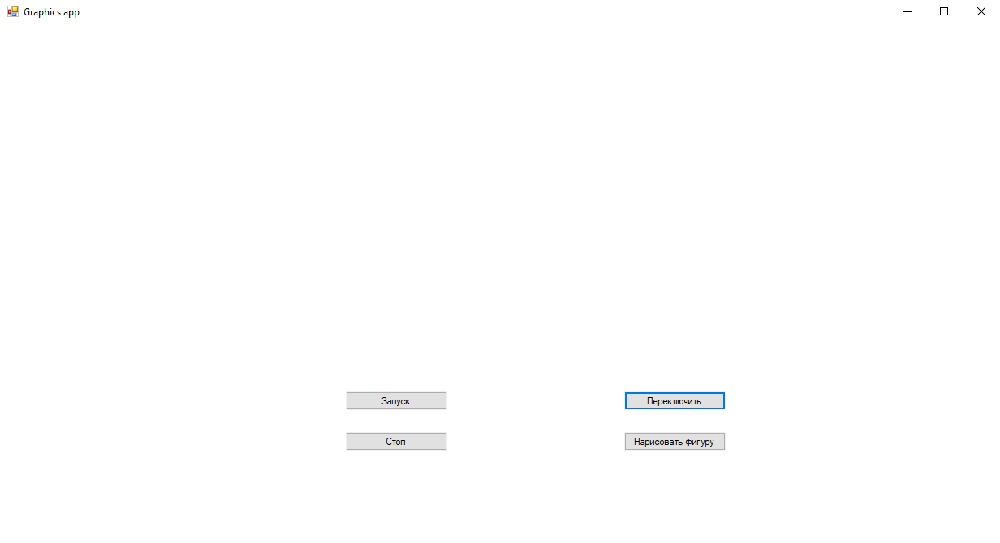
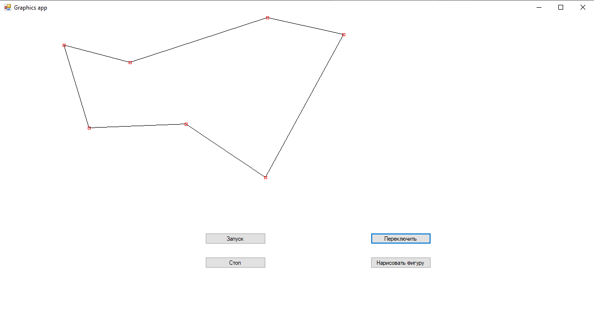
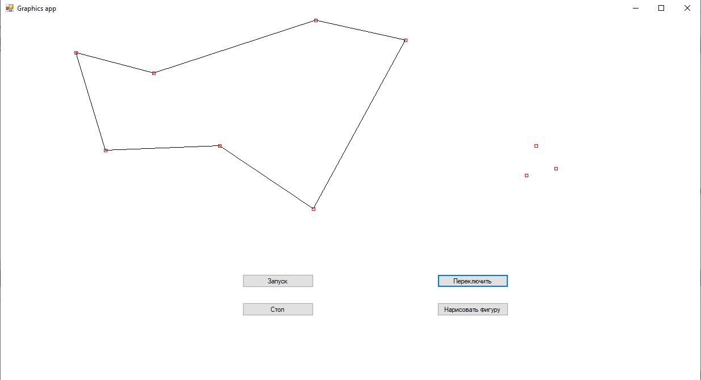
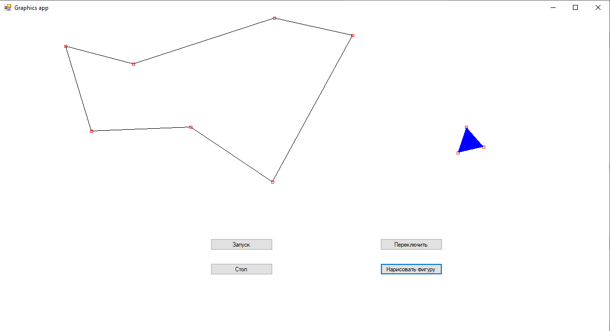
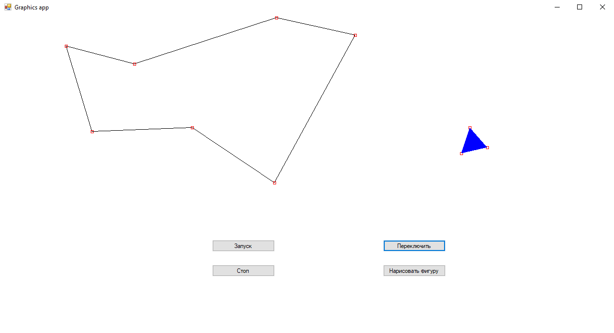
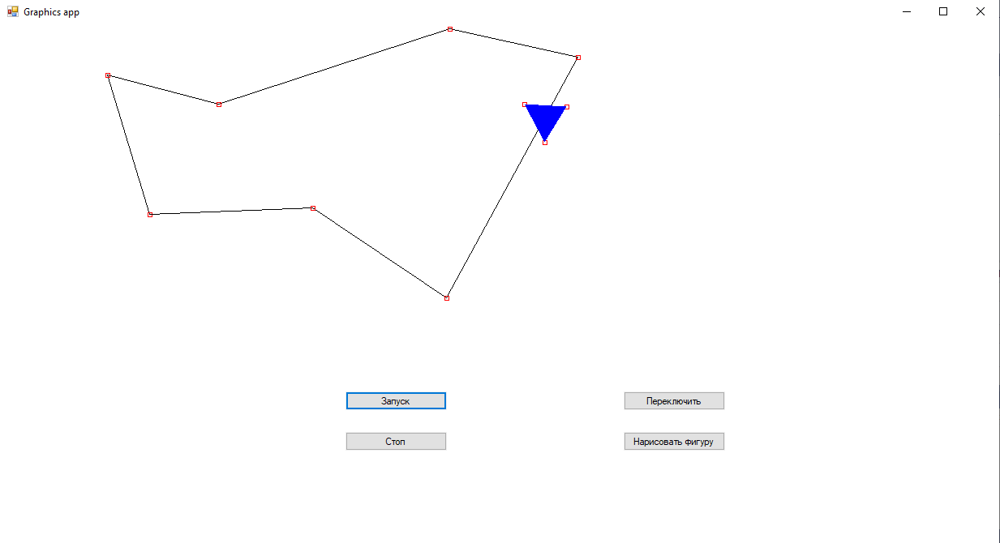
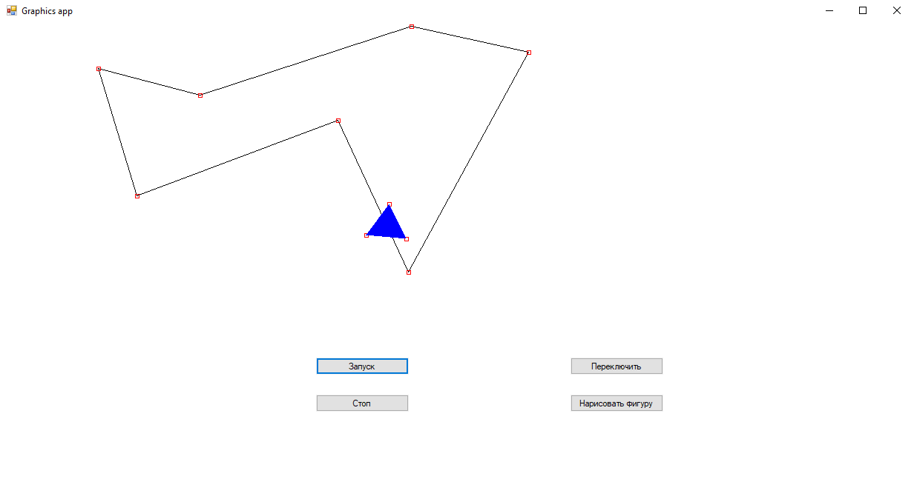
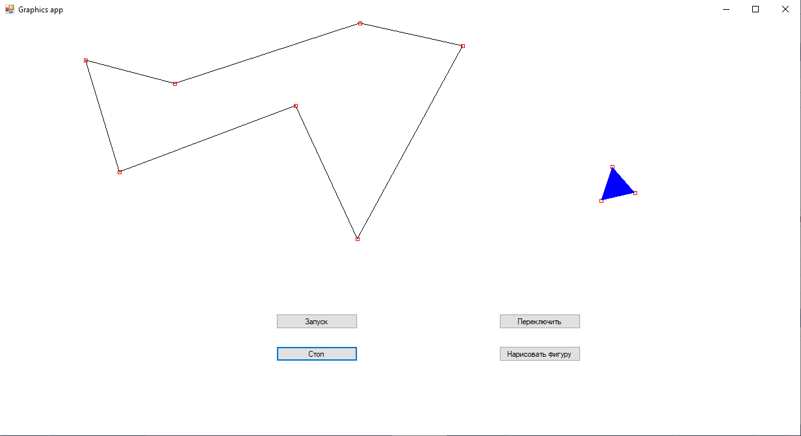

# Graphics-app
Graphics application on C#/.NET (desktop application)

This program is written using .NET Framework.

<h3>Here are examples of how this application works:</h3>

<strong>First of all, mark the route:</strong>

<strong>Then draw the figure:</strong>

<strong>So you can start the moving:</strong>

<strong>As you can see the figure is rotating during this motion:</strong>

<strong>You can also drag any point of the route:</strong>

<strong>After that you should stop the moving:</strong>

