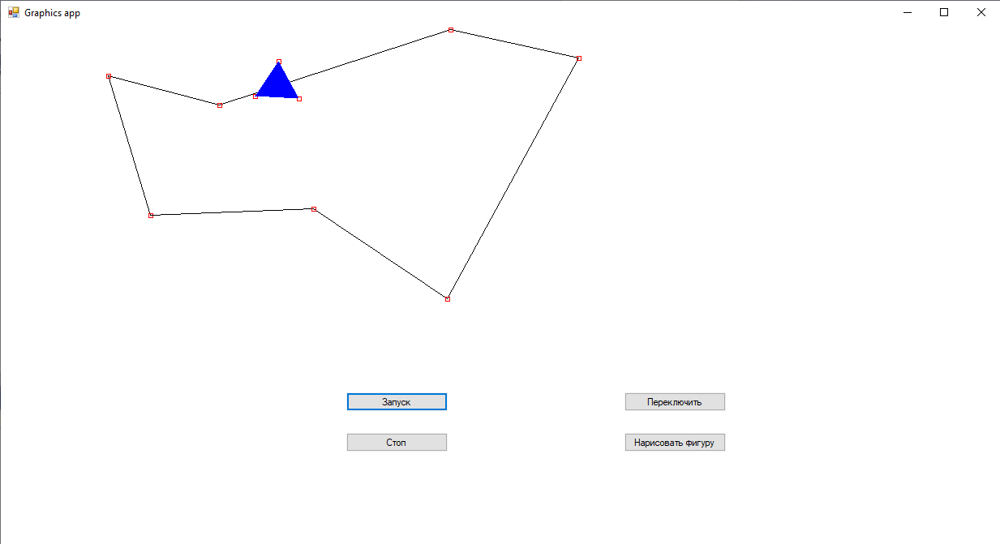

# Graphics-app
Graphics application on C#/.NET (desktop application)

This program is written using .NET Framework.

<h3>Here are examples of how this application works:</h3>

<strong>So here is the final result:</strong>

